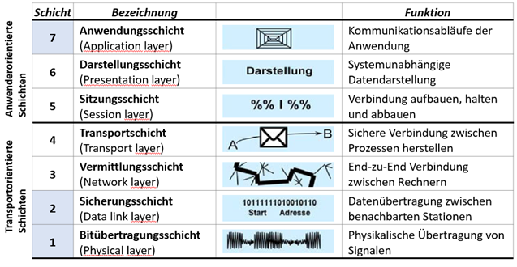

\vspace{12mm}

*Copyright- und Lizenz-Vermerk:
Das vorliegende Werk kann unter den Bedingungen der Creative Commons License CC-BY-SA 3.0, siehe
http://creativecommons.org/licenses/by-sa/3.0/deed.de, frei vervielfältigt, verbreitet und verändert werden. Eine kurze, allgemein verständliche Erklärung dieser Lizenz kann unter http://creativecommons.org/licenses/by-sa/3.0/deed.de gefunden werden. Falls Sie Änderungen durchführen, dokumentieren Sie diese im folgenden Änderungsverzeichnis:*

Datum            | Beschreibung der durchgeführten Änderung                          | Autor
---------------- | ------------------------------------------------------------------|---------------------------------------------------
09.04.2025       | V1.0 ...1.Version Basierend auf FI1 bis FI3 von Gebhard Klinkan   | Andreas Pötscher, HTL Linz–Paul-Hahn-Straße (LiTec)

# Einführung

Im OSI-Schichtenmodell wird beschrieben, welche Voraussetzungen erfüllt sein müssen, damit unterschiedliche Netzwerkkomponenten miteinander kommunizieren können. OSI steht für „Open Systems Interconnection“ und bedeutet auf Deutsch „Offenes System für Kommunikationsverbindungen“.

Die Internationale Organisation für Normung (ISO) setzte 1977 ein Komitee ein, um das OSI-Modell zu entwickeln. Im Jahr 1983 wurde das Modell als internationaler Standard anerkannt. Das ISO/OSI-Referenzmodell (ISO 7498) dient der abstrakten Beschreibung der Interprozesskommunikation zwischen räumlich getrennten Kommunikationspartnern.

Das OSI-Modell basiert auf einem Schichtenansatz, bei dem jede Schicht der darüberliegenden Schicht eine Reihe zusammengehöriger Dienste zur Verfügung stellt und ihrerseits grundlegende Funktionen von der darunterliegenden Schicht anfordert. Die einzelnen Schichten sind so definiert, dass Änderungen an einer Schicht keine Anpassungen an den übrigen Schichten erfordern.

{ width=80% }

# Transportorientierte Schichten

Die transportorientierten Schichten dienen zum Austausch zwischen den Daten von verteilten Prozessen. Z.B. Webserver und Brower oder 2 Microcontroller die über ein Busssystem kommunizieren. Die folgenden 4 Schichten sind dabei je nach Anwendungsfall nicht immer vorhanden bzw. notwendig. 

Feldbussystemen verwenden in der Regel nur die Schichten 1 und 2. Ethernet und einige auf dem TCPIP-Protokoll aufbauende Feldbusse nutzen auch die Schichten 3 und 4. 

## Bitübertragungsschicht (Physical layer), Schicht 1

Die Bitübertragungsschicht ist für die Übertragung der Bitströme über das Übertragungsmedium (Kabel, Funk) zuständig. Sie legt die elektrische, mechanische und funktionale Schnittstelle zum Übertragungsmedium fest.

**Parameter der Bitübertragungsschicht**:

- Übertragungsmedium (Kupfer, Glasfaser, Funk)
- Die Funktion der einzelnen Leitungen (Datenleitung, Steuerleitung)
- die Übertragungsrichtung (simplex, halb-duplex, duplex)
- Übertragungsgeschwindigkeit

## Sicherungsschicht (Data Link Layer), Schicht 2

Die Sicherungsschicht sorgt für den zuverlässigen Austausch von Datenpaketen zwischen den Stationen. 

**Folgende Aufgaben werden in der Sicherungsschicht erledigt**:

- Zugriffssteuerung auf das Übertragungsmedium. Medium Access Controll (MAC).
- Schreiben der physikalischen Sende- und Empfangsadressen in die Datenpakete. 
- Aufteilen des Bitdatenstroms in Datenpakete.
- Fehlererkennung bei der Datenübertragung und Korrektur. 

## Netzwerk- oder Vermittlungsschicht (Network Layer), Schicht 3

Die Netzwerkschicht steuert den Austausch von Datenpaketen, da diese nicht direkt an das Ziel vermittelt werden können und deshalb mit Zwischenzielen versehen werden müssen. Die Datenpakete werden dann von Knoten zu Knoten übertragen bis sie ihr Ziel erreicht haben.

**Aufgaben der Netzwerkschicht**:

- Identifikation einzelner benachbarter Netzknoten.
- Auf und Abbau von Verbindungskanälen (Routing-Tabellen).
- Wegfindung vom Sender zum Empfänger durch logische Adressierung (Routing).

## Transportschicht (Transport Layer), Schicht 4

Die Transportschicht ist die oberste Schicht des Transportsystems und damit das Bindeglied zu den anwendungs¬orientierten Schichten. Hier werden die Datenpakete einer Anwendung zugeordnet.

**Aufgaben der Transportschicht**:

- Auf- und Abbau von Verbindungen
- Zuordnung von Datenpakete zu Applikationen
- Segmentierung von Datenpaketen beim Senden
- Richtige Zusammensetzung der Datenpakete beim Empfangen

# Anwendungsorientierte Schichten

Die Anwendungsorierten Schichten sind je nach Anwendungsfall mehr oder weniger stark miteinander vermischt. Im einfachsten Fall gibt es nur eine Schicht 7 die die Anwendung selbst darstellt.

## Sitzungsschicht (Session Layer), Schicht 5

Die Sitzungsschicht ist die unterste Schicht des Anwendungssystems (Schicht 5-7) und baut logische Verbindungen zwischen Sender und Empfänger auf, kontrolliert diese und beendet sie wieder.
Es wird beispielsweise festgelegt, wie eine Sitzung zeitlich abzulaufen hat: Aufforderung zum Senden eines Passwortes, Senden des Passwortes, Bestätigung des Passwortes.

## Darstellungsschicht (Presentation Layer), Schicht 6

Die Präsentationsschicht fungiert als Dolmetscher, indem sie die Datenpakete in das jeweilige Format des Sender- oder Empfängers übersetzt. Datenkompression und Datenverschlüsselung gehören auch zu ihren Aufgaben. Formate und Codierungen dieser Schicht: ASCII, JPEG, HTML, Unicode, JSON, XML, ...

## Anwendungsschicht (Application Layer), Schicht 7

Die Anwendungsschicht ist die Schnittstelle zur eigentlichen Benutzeranwendung. Hier werden die Netzwerkdaten in vom Benutzer verwendbare Daten umgewandelt.

Beispiele von Benutzeranwendungen: FTP, HTTP, SMTP, MQTT

# Anwendungsbeispiel

**Auf einem Laptop wird im WLAN ein Film gestreamt.**

**Schicht 7** – Anwendungsschicht (Application Layer)
Der Benutzer öffnet auf dem Laptop einen Browser (z. B. Chrome) und ruft die Adresse des Streaminganbieters auf.
→ Der Browser ist die Anwendung, die HTTP/HTTPS verwendet, um mit dem Server zu kommunizieren.

**Schicht 6** – Darstellungsschicht (Presentation Layer)
Hier werden Datenformate übersetzt: z. B. wird das vom Server gesendete Video in ein Format umgewandelt, das der Laptop darstellen kann (z. B. H.264, MP4).
→ Auch Verschlüsselung/Entschlüsselung (TLS/SSL) passiert auf dieser Schicht.

**Schicht 5** – Sitzungsschicht (Session Layer)
Die Sitzung zwischen dem Laptop und dem Streamingserver wird verwaltet.
→ Beispielsweise wird sichergestellt, dass die Verbindung für den Film über eine gewisse Zeit aktiv bleibt (Session-Management).

**Schicht 4** – Transportschicht (Transport Layer)
Hier kommt TCP zum Einsatz: Es stellt sicher, dass alle Datenpakete vollständig und in der richtigen Reihenfolge ankommen.
→ Der Stream wird in kleine Pakete zerlegt und bei Bedarf erneut gesendet (Fehlerkorrektur, Flusskontrolle).

**Schicht 3** – Vermittlungsschicht (Network Layer)
Das IP-Protokoll (z. B. IPv4) wird verwendet, um die Route vom Laptop zum Server zu bestimmen.
→ Die IP-Adresse des Streamingservers wird verwendet, um Daten über das Internet weiterzuleiten.

**Schicht 2** – Sicherungsschicht (Data Link Layer)
Daten werden in Frames verpackt und über das WLAN-Netzwerk übertragen.
→ Hier wirken WLAN-spezifische Protokolle (z. B. IEEE 802.11), und MAC-Adressen kommen zum Einsatz.

**Schicht 1** – Bitübertragungsschicht (Physical Layer)
Die digitalen Daten (Bits) werden über das WLAN-Funkmodul des Laptops als elektromagnetische Signale übertragen.
→ Diese Signale werden vom WLAN-Router empfangen und über weitere physikalische Medien (z. B. Glasfaser, Kupferleitungen) bis zum Rechenzentrum des Streaminganbieters weitergeleitet.
