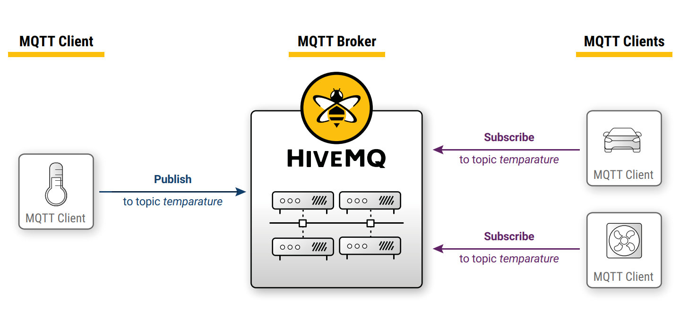
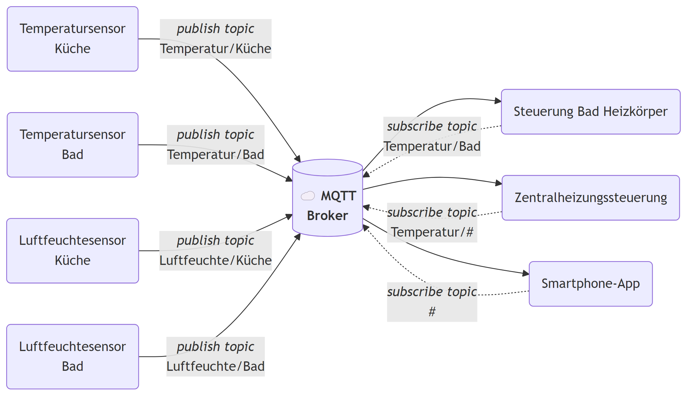
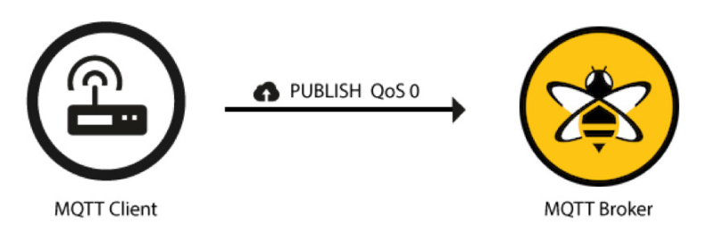
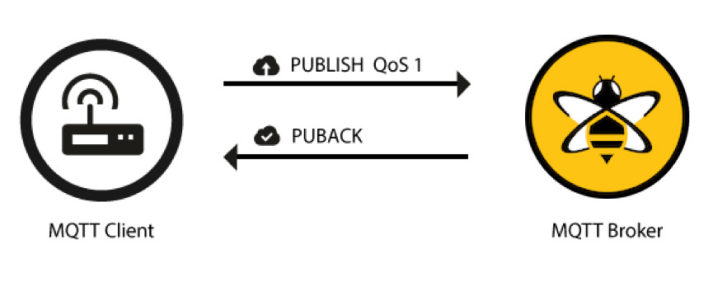
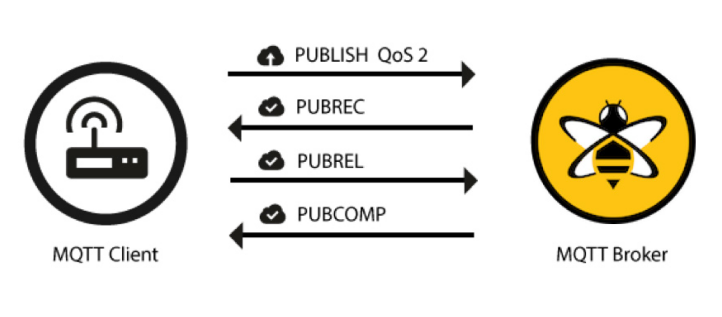

\vspace{12mm}

*Copyright- und Lizenz-Vermerk:
Das vorliegende Werk kann unter den Bedingungen der Creative Commons License CC-BY-SA 3.0, siehe
http://creativecommons.org/licenses/by-sa/3.0/deed.de, frei vervielfältigt, verbreitet und verändert werden. Eine kurze, allgemein verständliche Erklärung dieser Lizenz kann unter http://creativecommons.org/licenses/by-sa/3.0/deed.de gefunden werden. Falls Sie Änderungen durchführen, dokumentieren Sie diese im folgenden Änderungsverzeichnis:*


Datum            | Beschreibung der durchgeführten Änderung                          | Autor
---------------- | ------------------------------------------------------------------|---------------------------------------------------
09.04.2025       | V1.0 ...1.Version Basierend auf FI1 bis FI3 von Gebhard Klinkan   | Andreas Pötscher, HTL Linz–Paul-Hahn-Straße (LiTec)


# Einleitung

MQTT (Message Queuing Telemetry Transport) ist ein schlankes Messaging-Protokoll, das speziell für mobile Anwendungen und das Internet der Dinge (IoT) entwickelt wurde. Inzwischen erfreut sich MQTT wachsender Beliebtheit – insbesondere im Bereich der Hausautomatisierung sowie in zahlreichen Open-Source-Projekten.

Das Protokoll wurde 1999 von Dr. Andy Stanford-Clark (IBM) und Arlen Nipper (Arcom) entwickelt, um eine Ölpipeline in der Wüste zu überwachen. Heute ist MQTT ein offizieller OASIS-Standard (Eine Standardisierungsorganisation) und liegt derzeit in der Version 5.0 vor.

Neben Zuverlässigkeit lag der Fokus bei der Entwicklung vor allem auf einem sparsamen Umgang mit Bandbreite und Systemressourcen. Das Protokoll ist einfach aufgebaut und sehr leichtgewichtig. Für die Implementierung wird nur wenig Code benötigt – wie etwa die MQTT-Client-Bibliothek für den Arduino-Mikrocontroller zeigt.

MQTT eignet sich hervorragend für die Kommunikation mit mobilen Geräten wie Smartphones oder IoT-Komponenten, bei denen Bandbreite und Energieverbrauch begrenzt sind. Dank des kompakten Binärformats erfolgt die Nachrichtenübertragung nahezu in Echtzeit.

Das Protokoll macht keine Vorgaben zum Inhalt der Nachrichten – sowohl Text-, Binär- als auch Objektnachrichten sind möglich.


# Publish Subscribe Modell

Beim Pub/Sub-Modell entfällt die direkte Kommunikation zwischen dem Sender und dem Empfänger einer Nachricht. Stattdessen ermöglicht der Einsatz eines Brokers (eine Datenvermittlungssoftware) die Kontrolle darüber, welcher Empfänger welche Nachricht erhält. Der Broker ist eine eigenständige Software, die typischerweise auf einem separaten Rechner (z. B. in der Cloud) gehostet wird und die Verteilung der Daten übernimmt.

Die Entkopplung von Sender und Empfänger bietet zwei wesentliche Vorteile: die Trennung von Raum und Zeit.

- **Raum:** Der Sender und der Empfänger müssen über das Netzwerk nicht gegenseitig erreichbar sein. Sie können sich beispielsweise in zwei privaten Netzwerken befinden und über einen öffentlich erreichbaren Broker kommunizieren.

- **Zeit:** Sender und Empfänger müssen nicht zur selben Zeit laufen. Die Daten werden vom Broker zwischengespeichert und zeitversetzt zugestellt. Es gehen also keine Daten verloren. Selbst wenn der Empfänger für längere Zeit offline ist.


{ width=80% }

## Client

Ein MQTT-Client ist jedes netzwerkfähige Gerät, das über MQTT kommuniziert. Clients können gleichzeitig Nachrichten veröffentlichen und abonnieren. Sie können, müssen aber nicht, gleichzeitig Publisher und Subscriber sein. Dank der schlanken und leichtgewichtigen Implementierung eignet sich MQTT besonders gut für kleine, ressourcenarme Geräte. Es existieren umfangreiche MQTT-Client-Bibliotheken für viele Programmiersprachen und Plattformen. Z.B. Python, Java, C, Node-Red, ....

## Broker

Ein MQTT-Broker ist die zentrale Instanz innerhalb des Publish/Subscribe-Kommunikationsmodells. Er übernimmt eine Vielzahl kritischer Aufgaben, um den Nachrichtenaustausch zwischen MQTT-Clients effizient, zuverlässig und sicher zu ermöglichen. Zu den Hauptaufgaben eines Brokers gehört der Empfang aller veröffentlichten Nachrichten von Clients. Anschließend filtert der Broker diese Nachrichten basierend auf den jeweiligen Topics und ermittelt, welche Clients ein entsprechendes Abonnement besitzen. Nur an diese abonnierenden Clients werden die Nachrichten weitergeleitet.

Darüber hinaus verwaltet der Broker Sitzungen für Clients, deren Verbindungsstatus über mehrere Sitzungen hinweg erhalten bleiben soll. Das bedeutet, dass er nicht nur die Abonnements speichert, sondern auch Nachrichten zwischenspeichert, die während einer Offline-Phase eines solchen Clients eingegangen sind, sodass diese später zuverlässig zugestellt werden können. 

Ein weiterer zentraler Aspekt ist die Sicherheit: Der Broker übernimmt sowohl die Authentifizierung (Überprüfung der Identität von Clients) als auch die Autorisierung (Prüfung, ob ein Client bestimmte Aktionen ausführen darf, z. B. auf ein Topic zugreifen).

## Verbindungsaufbau

Der Verbindungsaufbau von Client zum Broker wird vom Client initiiert. Dazu sendet der Client eine MQTT Connect Message zum Broker. Diese beinhaltet folgende Parameter:

- **ClientID** Eindeutige Kennung des Client. Wird meistens vom Client automatisch generiert.
- **Clean Session** 
    - `true` bedeutet, dass der Broker beim Verbindungsabbruch die Sitzungsdaten des Clients löscht. Das heißt, wenn sich derselbe Client erneut verbindet, wird er vom Broker nicht wiedererkannt. 
    - `false` bedeutet, dass der Broker die Verbindungsdaten des Clients speichert. Wenn sich derselbe Client erneut verbindet, wird er wiedererkannt. Das bedeutet, dass bestehende Subscriptions erhalten bleiben. Falls der Client während seiner "Offline-Zeit" Nachrichten verpasst hat, werden diese – je nach QoS – nachträglich zugestellt.
- **Username/Passwort** Für die Authentifizierung des Clients.
- **Will Message** Messages die vom Broker im Namen des Clients gesendet wird wenn die Verbindung unerwartet unterbrochen wird. 
- **KeepAlive** Zeitintervall in Sekunden in dem zwischen Client und Broker mindestens ein KeepAlive Signal gesendet werden muss. Das Keepalive Signal wird in Form eines Pings gesendet.

## Publish

Hat ein Client die Verbindung zum Broker aufgebaut kann er dort Daten publishen. Eine Publish Message enthält folgende Informationen:

- **Topic:** Das Topic ist ein einfacher String der das Thema der Nachricht enthält. Das Topic kann durch slashes strukturiert werden. Z.B. `home/livingroom/temperature`.
- **QoS** Quality of Service. Es gibt 3 Levels 0,1,2. Bestimmt mit welcher Zuverlässigkeit die Nachrichten ankommen.
- **Retain Flag** Bestimmt ob eine Message beim Broker als letzter bekannter des Clients zu einem bestimmten Topic gespeichert.
- **Payload** Inhalt der Nachricht. Unterschiedliche Datentypen sind hier möglich. Zahlenwert, Strings, verschachtelte Daten als json Sting. Alle Arten von Binärdaten. 
- **Packet Identifier** Eindeutige Kennung der Nachricht. Wichtig für QoS > 0.

Wenn der Broker die Daten erhalten hat wird die Nachricht je nach QoS bestätigt und dannach an alle Client die das Topic der Nachricht gelesen haben weitergeleitet.

## Subscribe

Damit ein Client eine bestimmte Message erhält muss diese zuerst subscribed werden. Dazu sendet der Client eine Subscribe Message zum Broker. Diese Message kann eine oder auch mehrere Topics beinhalten.

Der Broker speichert die Subscriptions seiner Clients und sendet daraufhin Nachrichten dementsprechend weiter.

# Beispiel

Die Kommunikation mit Node Red lässt sich am besten mit einen Beispiel zeigen.

Es sollen die Temperatur und Luftfeuchtedaten von einem Haus über MQTT für verschiedene Zwecke verfügbar sein. Dazu müssen die Sensoren in den jeweiligen Räumen ihre Werte unter einem *Topic* publishen. Also an den Broker senden. Andere Clients können die Daten dann wiederrum subscriben und so empfangen. 




# Detailierte Beschreibung der Message Parameter

In diesem Kapitel werden einige wichtige Parameter für den Message Austausch beschrieben.

## Topics

Topics sind Adressinformationen, über die Nachrichten an bestimmte Subscriber zugestellt werden können. Der Datentyp eines Topics ist immer ein String. Ein Topic besteht aus einem oder mehreren Topic-Levels, die durch einen Schrägstrich (/) getrennt sind, zum Beispiel:

```txt
myhome/groundfloor/livingroom/temperature
```

Topics dürfen keine Leerzeichen enthalten und sind case-sensitiv, das heißt, Groß- und Kleinschreibung wird unterschieden.
Damit mehrere Topics strukturiert abonniert werden können, gibt es sogenannte Wildcards. Dabei unterscheidet man zwischen zwei Arten:

**Single Level Wildcard `+`**

Mit einer Single-Level-Wildcard kann auf alle Möglichkeiten eines einzelnen Topic-Levels abonniert werden. Zum Beispiel mit:

```txt
myhome/groundfloor/+/temperature
```

werden folgende Topics abonniert:

```txt
myhome/groundfloor/livingroom/temperature
myhome/groundfloor/kitchen/temperature
myhome/groundfloor/bathroom/temperature
```

**Multi Level Wildcard `#`**

Mit einer Multi-Level-Wildcard können alle unter einem bestimmten Topic-Level liegenden Topics abonniert werden. Die Multi-Level-Wildcard darf nur am Ende eines Subscriptionspfads verwendet werden. Zum Beispiel mit:

```txt
myhome/groundfloor/#
```

werden folgende Topics abonniert:

```txt
myhome/groundfloor/livingroom/temperature
myhome/groundfloor/livingroom/brightness
myhome/groundfloor/kitchen/temperature
```

## Quality of Service

Der Begriff Quality of Service (QoS) bezeichnet im MQTT-Protokoll den Grad der Zuverlässigkeit, mit dem Nachrichten zwischen Publisher und Subscriber übertragen werden. MQTT definiert drei QoS-Stufen: 0, 1 und 2. Jede Stufe bietet spezifische Garantien hinsichtlich der Nachrichtenübermittlung und stellt einen Kompromiss zwischen Zuverlässigkeit und Ressourcenverbrauch dar.

Die QoS wird für beide Seiten der Datenübertragung seperat eingestellt:

- Für die Übertragung vom Client (Publisher) zum Broker
- Für die Übertragung vom Broker zum Client (Subscriber)
  

**QoS 0: At most once**

QoS 0 ist die einfachste und schnellste Stufe der Nachrichtenübertragung im MQTT-Protokoll. Dabei wird die Nachricht ohne jegliche Bestätigung vom Sender an den Broker übertragen. Es gibt keine Garantie, dass die Nachricht den Empfänger erreicht. Weder der Sender noch der Broker speichern die Nachricht oder versuchen eine erneute Übertragung. Daher wird dieses Verfahren auch als „Fire and Forget“ bezeichnet.

{ width=50% }

**QoS 1: At least once**

Bei QoS 1 wird garantiert, dass eine Nachricht mindestens einmal zugestellt wird. Der Sender speichert die Nachricht so lange, bis er eine Bestätigung (PUBACK) vom Empfänger erhalten hat. Erfolgt diese Bestätigung nicht innerhalb eines festgelegten Timeouts, wird die Nachricht erneut gesendet.

Das bedeutet, dass beim Einsatz von QoS 1 Duplikate möglich sind, die vom Empfänger entsprechend behandelt (z. B. gefiltert) werden müssen.

{ width=50% }


**QoS 2: Exactly once**

Bei QoS 2 wird die Nachricht garantiert genau einmal zugestellt. Es handelt sich um die sicherste, aber zugleich auch langsamste Nachrichtenqualität im MQTT-Protokoll. Für die Zustellung sind zwei Handshakes, also insgesamt vier Nachrichten, erforderlich:
Ein erster Handshake zur Übertragung und Bestätigung der Nachricht, und ein zweiter, um die Packet Identifier (Packet ID) beim Sender und Empfänger freizugeben, damit diese erneut verwendet werden können.

{ width=50% }


Für QoS 1 und QoS 2 werden – sofern der Client beim Verbindungsaufbau eine dauerhafte Verbindung (cleanSession = false) gewählt hat – die Nachrichten vom Broker zwischengespeichert und bei einer erneuten Verbindung an den Client zugestellt.

## Retained Messages

Wird bei einer Nachricht das Retained-Flag gesetzt, speichert der Broker die letzte Nachricht zu diesem Topic zwischen. Jeder Client, der dieses Topic abonniert, erhält beim Abonnement diese Nachricht als zuletzt bekannten gültigen Wert sofort zugestellt.


