\vspace{12mm}

*Copyright- und Lizenz-Vermerk:
Das vorliegende Werk kann unter den Bedingungen der Creative Commons License CC-BY-SA 3.0, siehe
http://creativecommons.org/licenses/by-sa/3.0/deed.de, frei vervielfältigt, verbreitet und verändert werden. Eine kurze, allgemein verständliche Erklärung dieser Lizenz kann unter http://creativecommons.org/licenses/by-sa/3.0/deed.de gefunden werden. Falls Sie Änderungen durchführen, dokumentieren Sie diese im folgenden Änderungsverzeichnis:*


Datum            | Beschreibung der durchgeführten Änderung                          | Autor
---------------- | ------------------------------------------------------------------|---------------------------------------------------
09.04.2025       | V1.0 ...1.Version Basierend auf FI1 bis FI3 von Gebhard Klinkan   | Andreas Pötscher, HTL Linz–Paul-Hahn-Straße (LiTec)


\newpage{}

# Serielle Datenübertragung

Grundsätzlich gibt es zwei Möglichkeiten der Datenübertragung von einem Gerät (PC, Microcontroller, ...) zum anderen. Erstens die parallele Datenübertragung. Dabei werden mehrere Bits parallel auf mehreren Leitungen übertragen. 

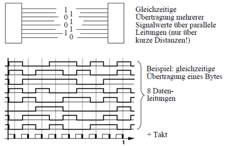{ width=50% }

Die zweite Möglichkeit ist die serielle Datenübertragung. Dabei werden die einzelnen Bits hintereinander (seriell) übertragen. Die meisten Schnittstelle sind heute serielle Schnittstellen.

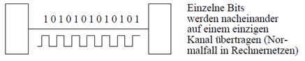{ width=50% }

Die serielle Datenübertragung eignet sich sowohl für die Kommunikation zwischen zwei Teilnehmern (Punkt-zu-Punkt) als auch für mehrere Teilnehmer. 

## Betriebsarten

Charakteristisch für eine serielle Übertragungsstrecke ist Richtung des Datenverkehrs. Dabei kann auf auf einer Leitung in eine Richtung übertragen werden (**simplex**). Auf einer Leitung abwechselnd in beide Richtungen (**halbduplex**) und auf 2 Leitungen gleichzeitig in beide Richtungen (**duplex**). 

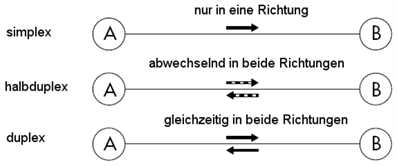{ width=50% }

## Serielle Synchrone Datenübertragung

Damit bei der seriellen Datenübertragung die Daten vom Empfänger zum richtigen Zeitpunkt gelesen werden können, ist es notwendig, die beiden Teilnehmer zu synchronisieren. Eine Möglichkeit hierfür ist die synchrone Datenübertragung. Dabei synchronisieren die Kommunikationspartner die Übertragung zeitlich mithilfe eines Taktsignals. Dieses Taktsignal kann entweder über eine eigene Leitung der Schnittstelle übertragen oder vom Empfänger aus dem Datensignal zurückgewonnen werden.

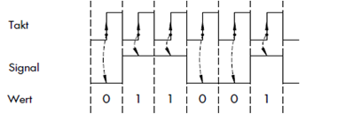{ width=50% }


## Serielle Asynchrone Datenübertragung

Die Kommunikationspartner verwenden voneinander unabhängige Taktquellen; es wird kein Taktsignal übertragen. Das bedeutet, dass das Senden eines Bytes zu jedem beliebigen Zeitpunkt beginnen kann. Damit der Empfänger den Beginn eines Zeichens oder Datenpakets erkennen kann, muss der Übertragung eine eindeutige Startkennung vorausgehen – diese wird durch ein Startbit realisiert. Der Empfänger weiß aufgrund der voreingestellten Übertragungsgeschwindigkeit, in welchem Zeitabstand die Leitung abgetastet werden muss.

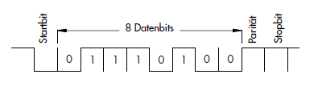{ width=50% }

Angenommen, der Wert 65 soll übertragen werden. In Binärform entspricht das:

```txt
01000001
```

Der Übertragungsrahmen sieht folgendermaßen aus (mit 1 Startbit, 8 Datenbits, 1 Paritätsbit, 1 Stoppbit).

```txt
Startbit  Datenbits       Paritätsbit   Stoppbit
   0      01000001           1             1
```

Bei der Übertragung wird zuerst das LSB (Niederwertigstes Bit) gesendet. Die vollständige Bitfolge lautet deshalb also: `0 01000001 1 1`. Am Signalverlauf kann das auch abgelesen werden da der früheste Zeitpunkt ganz links ist.

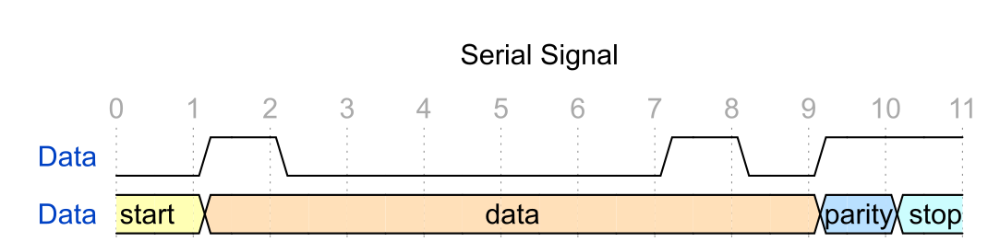{ width=80% }


Der Verlauf bei Sender und Empfänger sieht so aus: 

|   | Sender (Übertragung)                                    | Empfänger (Empfang & Verarbeitung)                                         |
|--:|---------------------------------------------------------------|----------------------------------------------------------------------------|
| 1 | Wartet auf Ruhezustand (Leitung = logisch 1)                  | Überwacht die Datenleitung auf Pegelwechsel von 1 auf 0                    |
| 2 | Sendet Startbit (logisch 0)                                   | Erkennt Startbit (Übergang 1 → 0) und startet internen Takt zur Abtastung  |
| 3 | Sendet Datenbits (meist 8, LSB zuerst)                        | Taktet eigene Uhr und liest jedes Bit zur Mitte der erwarteten Bitzeit     |
| 4 | (Optional) Sendet Paritätsbit zur Fehlererkennung             | (Optional) Liest Paritätsbit und prüft auf Übertragungsfehler              |
| 5 | Sendet Stoppbit(e) (logisch 1)                                | Erwartet mindestens ein Stoppbit (logisch 1)                               |
| 6 | Übertragung abgeschlossen, Leitung geht zurück in Ruhezustand | Übernimmt Daten ins Empfangsregister; wartet auf nächste Startbit-Erkennung|


## Paritätsprüfung

Zur Fehlerüberprüfung bei seriellen Schnittstellen kann eine Paritätsprüfung verwendet werden. Durch das Anhängen eines Paritätsbits wird die Bitfolge so erweitert, dass die Anzahl der Einsen in der Bitfolge stets gerade (Even Parity) oder ungerade (Odd Parity) ist. 

**Ungerade Parität (odd)**

gerade Anzahl 1er  | 1 | 0 | 0 | 1 | 1 | 1 | 0 | 0 |       |
|------------------|---|---|---|---|---|---|---|---|-------|
mit parity Bit     | 1 | 0 | 0 | 1 | 1 | 1 | 0 | 0 | **1** |


ungerade Anzahl 1er| 1 | 0 | 0 | 1 | 0 | 1 | 0 | 0 |       |
|------------------|---|---|---|---|---|---|---|---|-------|
mit parity Bit     | 1 | 0 | 0 | 1 | 0 | 1 | 0 | 0 | **0** |


**Gerade Parität (even)**

gerade Anzahl 1er  | 1 | 0 | 0 | 1 | 1 | 1 | 0 | 0 |       |
|------------------|---|---|---|---|---|---|---|---|-------|
mit parity Bit     | 1 | 0 | 0 | 1 | 1 | 1 | 0 | 0 | **0** |


ungerade Anzahl 1er| 1 | 0 | 0 | 1 | 0 | 1 | 0 | 0 |       |
|------------------|---|---|---|---|---|---|---|---|-------|
mit parity Bit     | 1 | 0 | 0 | 1 | 0 | 1 | 0 | 0 | **1** |


Die Paritätseinstellung muss beim Empfänger selbstverständlich mit der des Senders übereinstimmen. Somit kann der Empfänger, indem er die Anzahl der einsen zählt, überprüfen ob ein Bit fehlerhaft übertragen wurde. Sind 2 Bit fehlerhaft übertragen worden kann der Fehler mit der einer Paritätsprüfung nicht mehr gefunden werden. Dazu gibt es komplexere Methoden wie z.B. CRC-Prüfsummen. Darauf wird hier aber nicht näher eingegangen. 

## Übertragungsgeschwindigkeit

Für die Übertragungsgeschwindigkeit bei einer seriellen Schnittstelle gibt es mehrere Maßeinheiten. Die Bitrate gibt an, wie viele Datenbits pro Sekunde übertragen werden. Die Baudrate gibt an, wie oft das Signal pro Sekunde seinen Zustand wechselt. In den meisten Fällen (wenn es nur 2 Signalzustände gibt) ist die Baudrate gleich der Bitrate. Bei der seriellen Schnittstelle wird die Übertragungsgeschwindigkeit meist in Baud angegeben. Dabei wird meistens von der Bruttobaudrate gesprochen. Also von allen Bits die übertragen werden.

Um die tatsächliche Nutzdatenübertragung zu beschreiben gibt es den Begriff der Nettobaudrate. Die Nettobaudrate beschreibt die effektive Anzahl der tatsächlich übertragenen Nutzdaten pro Sekunde in einer seriellen Datenübertragung. Sie unterscheidet sich von der Bruttobaudrate, die alle übertragenen Bits pro Sekunde umfasst – also inklusive Steuerungs- und Prüfbits (z. B. Startbit, Stoppbit, Paritätsbit).

Die Nettobaudrate kann wie folgt berechnet werden.


$$
\text{Nettobaudrate} = \text{Bruttobaudrate} \times \left( \frac{\text{Nutzdatenbits}}{\text{Gesamtanzahl der übertragenen Bits pro Zeichen}} \right) $$

Werden Beispielsweise für 8 Bit Nutzdaten zusätzlich 3 Bit übertragen (Start, Stop, Parity) ergibt sich folgende Nettobaudrate für eine Bruttobaudrate von 9600 Baud (Bit/s).

$$ \text{6981 Bit/s} = \text{9600 Bit/s} \times \left( \frac{\text{8}}{\text{11}}\right) $$ 

## Datenkodierung

Über eine serielle Schnittstellen werden Datenpakete von jeweils 8 Bit übertragen. Wenn es sich bei den Daten um Zahlen handelt können diese einfach von einer Binär- in eine Dezimalzahl umgerechnet werden. 

Um Texte und Zahlen durch Daten darzustellen, kodiert man die Zeichen des Alphabets (Groß - und Kleinschreibung), die Satzzeichen wie Punkt, Komma und Semikolon, sowie einige Spezial-zeichen wie +, %, & und $ in Bitfolgen. Zudem benötigt man noch Steuerzeichen wie das Leer-zeichen (SP) den Wagenrücklauf (CR) und das Tabulatorzeichen (TAB). 

Bei einfachen seriellen Schnittstellen wird dazu meist **ASCII** (American Standard Code for Information Interchange) Code verwendet. Das ist eine 7 Zeichenkodierung die Steuerzeichen und 95 druckbaren Zeichen (Buchstaben und Ziffern). 

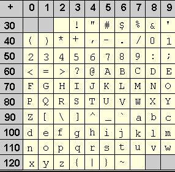{ width=40% }

# Standardisierte serielle Schnittstellen

## Arten der seriellen Schnittstellen

Die serielle Schnittstelle ist in verschiedenen Ausführungen weit verbreitet. Da die Datenübertragung bitweise seriell erfolgt, sind die Kosten für Kabel und Verdrahtung relativ gering. Der Aufbau ist einfach, und es können größere Entfernungen überbrückt werden.

Wird ohne genauere Kennzeichnung von einer „seriellen Schnittstelle“ gesprochen, ist damit in der Regel die V.24- bzw. RS-232-Schnittstelle gemeint. Moderne serielle Schnittstellen sind zum Beispiel RS-485, USB, Ethernet oder CAN. Diese werden jedoch umgangssprachlich meist nicht als serielle Schnittstellen bezeichnet.

Beispiele serieller Schnittstellen nach Verwendungszweck:

- Ursprüngliche serielle Schnittstellen-Standards: 
    - RS-232 – 1962 eingeführte serielle Schnittstelle
    - RS-422 – differentielle Transmitter und Receiver
    - RS-485 – differentielle Transceiver (abschaltbar) und Receiver

- Schnittstellen auf Chip-Ebene: 
    - I2C-Bus – mit Daten- und Taktsignal z. B. bei Telefonkarten
    - SPI - Serial Peripheral Interface mit Daten- und Taktsignal z. B. Serial-Flash-Speicher
    - One-Wire – Bussystem mit nur einer Datenleitung

- Schnittstellen innerhalb eines Computers
    - Serial ATA – für Verbindung Prozessor mit PC-Festplatte
    - PCI-Express – für Verbindung Prozessor mit Peripheriebaugruppen (Grafikkarten, ..)

- Schnittstellen in der Größenordnung 1 bis 10 Meter: 
    - USB - Universal Serial Bus
    - HDMI - High Definition Multimedia Interface - Digitale Übertragung von Videodaten
    - Bluetooth - Funknetzstandard für kleinere Distanzen (Headsets, Handy, ..)

- Bussysteme > 10m:
    - AS-Interface - Feldbus zum Anschluss von Aktoren und Sensoren
    - CAN-Bus  - Controller Area Network - Steuerungstechnik, Fahrzeugtechnik
    - Ethernet -  Ethernet basierende Bussysteme (Modbus, Profinet, EtherCAT, ..) 
    - WLAN - Funknetzstandard für mittlere Distanzen

## RS 232

RS-232 (Recommended Standard 232) ist eine inzwischen veraltete serielle Schnittstelle, die in früheren Computern verwendet wurde. Sie wurde in den frühen 1960er Jahren vom US-amerikanischen Standardisierungskomitee Electronic Industries Association (EIA) entwickelt.

Die RS-232-Schnittstelle definiert ein asynchrones Übertragungsprotokoll und wird oft auch als COM-Schnittstelle oder V.24-Schnittstelle bezeichnet. Hauptsächlich wurde sie zum Anschluss von Textterminals an Großrechner oder für Punkt-zu-Punkt-Verbindungen zwischen Computern über eine Modemverbindung genutzt. 

Bis zum Erscheinen des USB war praktisch jeder PC mit mindestens einer RS-232-Schnittstelle ausgestattet. Heute wird die RS 232 Schnittstelle hauptsächlich im Mikrocontroller Bereich und bei älteren Steuerungsgeräten eingesetzt. 

### Protokoll

Die Übertragung eines Datenworts beginnt mit einem vorangestellten Startbit. Mit der Signalflanke des Startbits synchronisiert der Empfänger seinen internen Bittakt auf die empfangenen Daten. Sowohl der Sender als auch der Empfänger müssen mit der gleichen Baudrate arbeiten.

Anschließend folgen 5 bis 8 Datenbits, beginnend mit dem niederwertigsten Bit (Least Significant Bit). Nach dem letzten Datenbit kann zur Erkennung von Übertragungsfehlern ein Paritätsbit gesendet werden. Das Ende der Übertragung wird durch ein oder zwei Stoppbits gekennzeichnet.

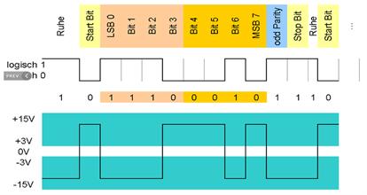{ width=50% }

### Datenleitungen

Die RS-232 Schnittstelle ist zur Verbindung von zwei Geräten konzipiert, die beide je eine Daten¬quelle und eine Datensenke besitzen können. Zur bidirektionalen Datenübertragung werden drei Leitungen benötigt: eine Sendeleitung (TxD),  eine Empfangsleitung (RxD) und eine Masseleitung.

### Handshake 

Zur Vermeidung von Datenverlusten muss der Empfänger die Datenübertragung anhalten können, wenn keine weiteren Daten mehr verarbeitet werden können. Dieser so genannte Handshake kann auf zwei Arten realisiert werden, mit Software über Steuercodes oder mit Hardware über Steuerleitungen

Beim Software-Handshake sendet der Empfänger zur Steuerung des Datenflusses spezielle Zeichen an den Sender. Beim Xon/Xoff-Protokoll sendet der Empfänger zur Steuerung des Datenflusses spezielle Zeichen an den Sender (Xon = 11h und Xoff = 13h)
Beim Hardware-Handshake steuert der Empfänger über die Request To Send (RTS) - Steuerleitung den Clear To Send (CTS) - Handshake Eingang des Senders.

### Elektrische Eingenschaften

Die RS-232 besitzt eine Spannungsschnittstelle. Signalpegel zwischen -3V und +3V gelten als undefiniert.

Daten | Pegel | Spannungsbereich |
------|-------|------------------|
   0  | High  | +3V bis +15V     |
   1  | Low   | -3V bis -15V     |

Wird beim einem Mikrocontroller (z.B. Arduino) eine serielle Schnittstelle verwendet wird TTL Logik verwendet. Das heißt, das Protokoll ist gleich. Nur die Spannungspegel sind unterschiedlich.

Daten | Pegel | Spannungsbereich |
------|-------|------------------|
   0  | High  |       0V         |
   1  | Low   |       5V         |

### Datenraten und Leitungslängen

Bei der asynchronen Schnittstelle haben sich bestimmte Datenraten historisch entwickelt. Hier wird die Datenrate in der Einheit Bits pro Sekunde (bps) bzw. Baud angegeben. Dabei werden alle Bits (auch Start- und Stopbit) gezählt und Lücken zwischen den Bytetransfers ignoriert. Typische  Datenraten liegen im Bereich  9600 … 115200 Baud.

Die maximal zulässige Kabellänge beträgt bei 19200 Baud maximal 15 Meter, bzw. ist durch die Kabelkapazität begrenzt. 

### Steckerbelegung

Für die RS 232 Schnittstelle wird typischerweise ein D-SUB DE9 Stecker verwendet.

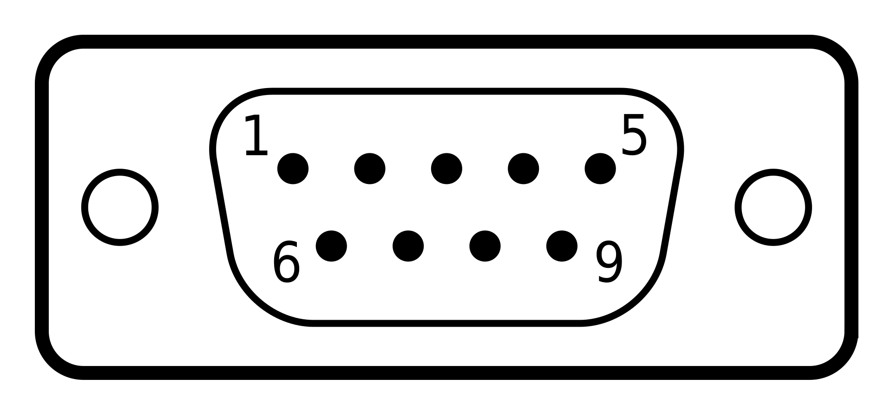{ width=30% }

Die Pins sind dabei wie folgt belegt. Es werden aber nicht alle Pins beschrieben.

PIN | Belegung | Name             | Eigenschaften 
----|----------|------------------|------------------------------------|
2   | RxD      | Receive          | Empfangsleitung                    |
3   | TxD      | Transmit         | Sendeleitung                       |
5   | GND      | Ground           | Gemeinsamer Ground                 |
7   | RTS      | Request to Send  | High -> Gerät will Daten senden    |
8   | CTS      | Clear to Send    | High -> Gerät kann Daten empfangen |

Beim Verbinden zweier gleichartiger Geräte, müssen die Signalleitungen gekreuzt werden (Tx mit Rx und CTS mit RTS).

Gerät A | Datenrichtung | Gerät B |
--------|:-------------:|---------|
  TxD   |      --->     |  RxD    |
  RxD   |      <---     |  TxD    |
  RTS   |      --->     |  CTS    |
  CTS   |      <---     |  RTS    |
  GND   |      ----     |  GND    |


### Virtueller COM Port

Ist eine Verbindung zu einem PC ohne eigene RS 232 Schnittstelle notwendig wird die RS232 Verbindung über USB emuliert. Dazu ist ein USB-zu-RS-232-Adapter oder ein Gerät mit eingebauten Wandlerchip (z.B Arduino Boards) notwendig. Der Seriellport (COM) wird als virtuelles Gerät auf dem Computer emuliert. Sobald der USB-Adapter angeschlossen ist, wird er vom Betriebssystem als virtueller COM-Port erkannt. Der Adapter wird in der Regel in den Gerätemanager des Computers integriert und erhält eine COM-Port-Nummer, z. B. COM1, COM2 usw.

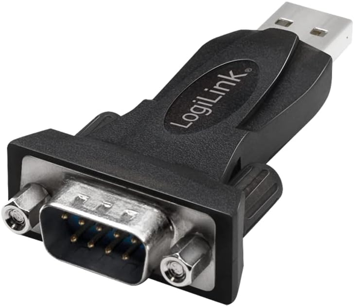{ width=30% }

## RS 422 und RS 485

RS-422 und RS-485 Schnittstellen wurden für die serielle Datenüber¬tragung mit hoher Geschwindigkeit über große Entfernungen entwickelt. Für beide Schnittstellen sind nur die elektrischen Eigenschaften und kein Protokoll und keine Steckerbelegung spezifiziert. 

Die seriellen Daten werden ohne Massebezug als Spannungsdifferenz von mindestens ±200 mV zwischen zwei symmetrischen Leitungen übertragen. Für jedes zu übertragende Signal existiert ein Aderpaar, das aus einer invertierten und einer nicht invertierten Signalleitung besteht. Insgesamt also 4 Leitungen. Die invertierte Leitung wird in der Regel durch den Index „A“ oder „–“ gekennzeichnet, während die nicht invertierte Leitung mit „B“ oder „+“ bezeichnet wird.

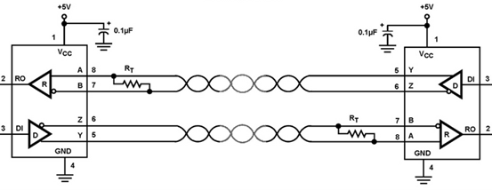{ width=70% }

Die Empfänger werten die Differenzspannung zwischen beiden Leitungen aus, so dass Gleichtakt-Störungen zu keiner Verfälschung des Nutzsignals führen. Durch die Verwendung von verdrillten abgeschirmten Leitungen lassen sich Distanzen von bis zu 1200 Metern mit einer Datenrate von bis zu 10Mbit/s realisieren. Die Leitungen müssen abgeschlossen werden.

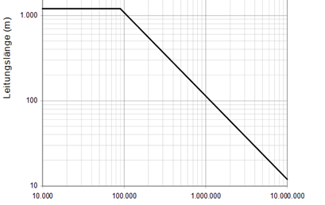{ width=70% }

An einem RS-422 Bus können mehrere Empfänger und genau ein Sender angeschlossen werden. Im Gegensatz dazu können an einem RS-485 Bus mehrere gleichwertige Teilnehmer senden und empfangen. RS-485 Sender besitzen dazu abschaltbare Endstufen.  Ein Protokoll stellt sicher, dass jeweils nur ein Sender am Bus aktiv ist. 

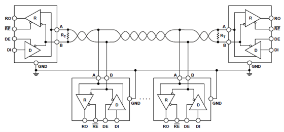{ width=70% }
