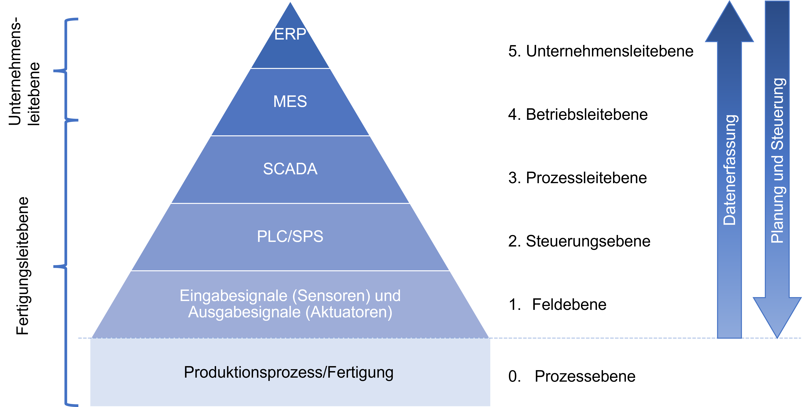
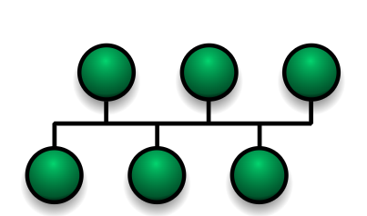
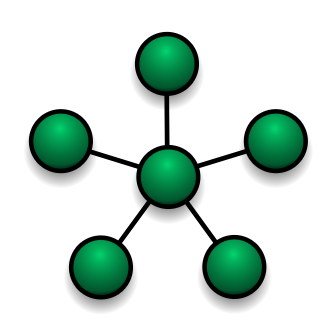
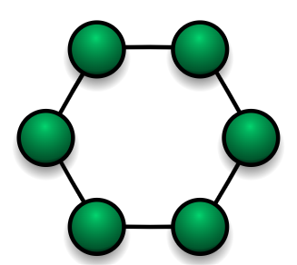

\vspace{12mm}

*Copyright- und Lizenz-Vermerk:
Das vorliegende Werk kann unter den Bedingungen der Creative Commons License CC-BY-SA 3.0, siehe
http://creativecommons.org/licenses/by-sa/3.0/deed.de, frei vervielfältigt, verbreitet und verändert werden. Eine kurze, allgemein verständliche Erklärung dieser Lizenz kann unter http://creativecommons.org/licenses/by-sa/3.0/deed.de gefunden werden. Falls Sie Änderungen durchführen, dokumentieren Sie diese im folgenden Änderungsverzeichnis:*

Datum            | Beschreibung der durchgeführten Änderung                          | Autor
---------------- | ------------------------------------------------------------------|---------------------------------------------------
09.04.2025       | V1.0 ...1.Version Basierend auf FI1 bis FI3 von Gebhard Klinkan   | Andreas Pötscher, HTL Linz–Paul-Hahn-Straße (LiTec)

# Einführung

Ein Bus ist ein System zur Datenübertragung zwischen mehreren Teilnehmern über ein gemeinsames Übertragungsmedium. Die an einen Bus angeschlossenen Komponenten werden auch als Busteilnehmer oder Busknoten bezeichnet.

Ein Feldbussystem ist ein Datennetzwerk auf industrieller Ebene. An dieses Netzwerk können E/A-Module (Ein-/Ausgabe-Module), Sensoren und Aktoren mit einem Steuerungsrechner verbunden werden. Feldbussysteme sind leistungsfähiger, flexibler und kostengünstiger als herkömmliche Verdrahtungslösungen und haben diese in der Praxis weitgehend ersetzt.

# Vorteile von Bussystemen

- Projektierungs- und Installationskosten
günstige Kabel, einfache Pläne, geringer Platzbedarf, schnelle und fehlersichere Verdrahtung
- einfache Erweiterbarkeit
zusätzliche Busteilnehmer über einfache Busverlängerung und Konfiguration in der Software
- Parameter- und Diagnosefunktionen
Parametrierung und laufende Überwachung aller Busteilnehmer im Betrieb

# Merkmale und Anwendungsbereiche

Aktuell ist eine Vielzahl an unterschiedlichen Bussystemen erhältlich. Die Systeme unterscheiden sich je nach Einsatzgebiet in der Netzarchitektur, im Datendurchsatz, in der Echtzeitfähigkeit und der Übertragungs¬technik.

Bussysteme sind oftmals für einen bestimmten Anwendungsbereich konzipiert, was aber nicht bedeutet, dass jeder Bustyp nur für eine bestimmte Anwendung verwendbar ist. Beispiel für verschiedene Anwendungen von Bussysteme sind:

**CAN-Bus (Controller Area Network)**

- Technik: Serielles Bussystem mit Prioritätssteuerung und Fehlersicherheit.
- Anwendung: Kfz-Elektronik (z. B. Motorsteuerung, Airbags, ABS).

**Profibus (Process Field Bus)**

- Technik: Industrielles Feldbussystem, unterstützt Master-Slave-Kommunikation.
- Anwendung: Automatisierungstechnik, SPS-Systeme in der Fertigung.

**Modbus:**

- Technik: Einfaches Master-Slave-Protokoll über serielle Schnittstellen oder TCP/IP.
- Anwendung: Gebäudeautomation, industrielle Kommunikation.

**I²C (Inter-Integrated Circuit)**

- Technik: Zweidraht-Bus für kurze Distanzen zwischen ICs, Master-Slave-Architektur.
- Anwendung: Kommunikation zwischen Mikrocontrollern und Sensoren.

**USB (Universal Serial Bus)**

- Technik: Serielles Plug-and-Play-Bussystem mit Hot-Plug-Funktion.
- Anwendung: PC-Peripheriegeräte wie Tastatur, Maus, Speichergeräte.

# Automatisierungspyramide

Die Verwendung von Bussystemen und Datenkommunikation kann, im Industriebereich, sehr gut über die Automatisierungspyramide gezeigt werden.

Die Informationen, die in den verschiedenen Prozessebenen zu übertragen sind, können nach Menge und Aufgabe der benötigten Komponenten in einer Pyramidenstruktur dargestellt werden.

{ width=80% }

Die Automatisierungspyramide teilt einen Produktionsbetrieb in 5 verschiedene Ebenen in denen verschieden IT Systeme zum Einsatz kommen. Es müssen aber nicht in jedem Betrieb alle Ebenen vorhanden sein.

## Unternehmensleitebene

Auf der Unternehmensleitebene werden die Managementaufgaben eines Produktionsunternehmens erledigt. Dazu gehören Auftragseingang, Bestellungen, Verwaltung, Abrechnung, usw.

Dazu wird typischerweise ein **ERP (Enterprise Resourece Planing)** System Verwendet.

## Betriebsleitebene

Auf der Betriebsleitebene wird die Produktion detailiert geplant. Es werden die Endprodukte in einzelne Baugruppen und Teile aufgeteilt. Weiters wird entschieden was, wann, in welcher Menge auf welcher Produktionsanlage produziert wird. 

Dazu wird typischerweise eine **MES (Manufactoring Execution System)** verwendet.

## Prozessleitebene

In der Steuerungs- oder Zellebene werden alle Automationsaufgaben von Automatisierungsgeräten wie Maschinen- oder Anlagensteuerungen ausgeführt. Die Automatisierungsgeräte sind in der Regel mit lokalen Bedienstationen ausgestattet. Die Steuerung wird hier meistens in sogenannten Leitwarten ausgeführt. 

Dazu wird typischerweise ein **SCADA (Supervisory Control and Data Acquisition)** System verwendet.

## Steuerungsebene

Auf der Steuerungsebene werden die einzelnen Maschinen und Anlagen gesteuert. Die Daten dazu erhalten die Steuerungen von der Prozessleitebene. 

Dazu wird typischerweise eine **SPS (Speicher programmierbare Steuerung)** verwendet.

## Feldebene

Auf der Feldebene befinden sich die Sensoren und Aktoren die in der Produktionsanlage verbaut sind. Dazu zählen alle Arten von Sensoren, elektrische Antriebe, pneumatische Antriebe, hydraulische Antriebe usw.

# Bustoplogien 

Die räumliche Verbindung der Busteilnehmer wird mit dem Begriff Topologie näher spezifiziert. Die Topologie eines Netzes ist entscheidend für seine Ausfallsicherheit. Nur wenn alternative Wege zwischen den Knoten existieren, bleibt bei Ausfällen einzelner Verbindungen die Funktionsfähigkeit teilweise oder ganz erhalten. In der Praxis unterscheidet man zwischen Linien-,  Stern,- und Ringtopologie und Kombinationen davon. 

## Bus/Linientopologie

{ width=25% }

Mehrere Teilnehmer werden an eine Busleitung über kurze Stichleitungen angeschlossen. Die Bus-Enden werden zur Vermeidung von Reflexionen terminiert. Eine Störung im Kabel blockiert den gesamten Netzstrang. Es kann immer nur ein Teilnehmer Daten senden. 

## Sterntopologie

{ width=25% }

Der Master ist der Sternmittelpunkt. Jeder Teilnehmer ist über eine eigene Leitung angekoppelt. Die gesamte Kommunikation wird vom Master gesteuert und über diesen abgewickelt. Fällt der Master aus, so ist keine Kommunikation mehr möglich. Mehrere Slaves können gleichzeitig Daten senden. Der Ausfall eines Teilnehmers hat keine Auswirkung auf den Rest des Bussystems. 

## Ringtopologie

{ width=25% }

Jede Station ist sowohl Sender als auch Empfänger. Die Daten umkreisen den Ring genau einmal und werden dabei von Station zu Station weitergereicht. Jede Station prüft, ob die Daten an sie gerichtet sind. Ist dies der Fall, übernimmt sie die Eingangsdaten und überträgt eigene Ausgangsdaten in das Telegramm. Eine Störung im Kabel blockiert den gesamten Ring. 

# Fehlererkennung 

# Buszugriffssteuerung